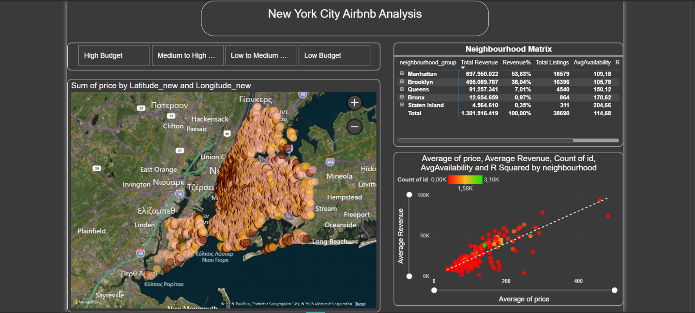

# New York City Airbnb Analysis

An interactive data exploration of Airbnb listings in New York City to guide new hosts on optimal location, room type, and pricing for competitive bookings.

---

## Team Members

- Elena Moysidou
- Antonis Karousis
- Christos Karlaftis

---

## Project Description

This project investigates Airbnb listings in New York City to provide data-driven guidance for new hosts. Using a dataset of NYC listings, we perform data cleaning, exploratory data analysis (EDA), and build an interactive Power BI dashboard to visualize insights on optimal property locations, room types, and pricing strategies. The dashboard helps hosts make informed decisions to maximize bookings while remaining competitive within a medium-budget range.

---

## Data Source

The dataset used in this analysis is available on Kaggle:  
[New York City Airbnb Open Data](https://www.kaggle.com/datasets/dgomonov/new-york-city-airbnb-open-data?utm_source=chatgpt.com)

---

## Repository Structure

This repository is organized as follows:

- **Dashboard Screenshots** – images of the interactive dashboard  
- **Data Cleaning** – scripts or notes on data preprocessing  
- **Interactive Dashboard** – Power BI `.pbix` file  
- **.gitignore** – ignored files  
- **README.md** – project documentation

---

## Interactive Dashboard

Here are some snapshots of the dashboard:  

	
---

